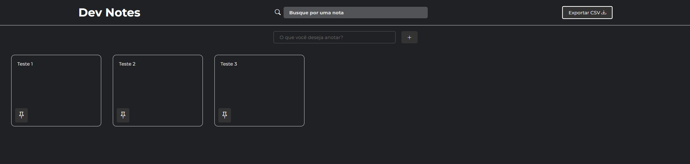

# 📝 Dev Notes

## 📚 Sobre o Projeto
Dev Notes é um aplicativo web para criar, organizar e gerenciar anotações de forma prática e eficiente. Com interface moderna e responsiva, permite que desenvolvedores e profissionais mantenham suas ideias sempre acessíveis e organizadas.

## ✨ Funcionalidades

- ➕ **Adicionar Notas**
  - Crie novas anotações rapidamente com um clique ou pressionando Enter
- 📝 **Editar Notas**
  - Edite o conteúdo das notas diretamente na interface
- 📌 **Fixar Notas**
  - Destaque notas importantes fixando-as no topo
- 📄 **Duplicar Notas**
  - Duplique qualquer nota para reutilizar conteúdos
- 🗑️ **Excluir Notas**
  - Remova notas indesejadas de forma simples
- 🔍 **Buscar Notas**
  - Encontre rapidamente qualquer anotação pelo conteúdo
- 📤 **Exportar para CSV**
  - Exporte todas as suas notas em formato CSV
- 💾 **Persistência Local**
  - Suas notas são salvas automaticamente no navegador
- 📱 **Design Responsivo**
  - Interface adaptável para desktop e mobile
- 🎨 **Visual Moderno**
  - Utilização de Bootstrap Icons e Google Fonts

## 🛠️ Tecnologias

- 
- 
- 
- 
- 

## 🚀 Como Usar

1. **Clone o repositório:**
  ```bash
   git clone https://github.com/seu-usuario/dev-notes.git
  ```
2. **Abra o projeto:**
  ```bash
  cd dev-notes
  code .  # Para abrir no VS Code
  ```
3. **Execute o aplicativo:**
  - Abra o `index.html` em seu navegador;
  - Ou utilize a extensão Live Server no VS Code.

## 📁 Estrutura do Projeto

```plaintext
    dev-notes/
    ├── [index.html](http://_vscodecontentref_/0)
    ├── [README.md](http://_vscodecontentref_/1)
    └── src/
        ├── css/
        │   └── style.css
        └── js/
            └── script.js
```
- **index.html:** Estrutura principal da aplicação;
- **src/css/style.css:** Estilos customizados e responsivos;
- **src/js/script.js:** Toda a lógica de manipulação de notas.

## 🔍 Principais Recursos do Código

```javascript
  // Exemplo: Fixar nota no começo
const toggleFixedNotes = (id) => {
  const notes = getNotes();
  const targetNote = notes.filter((note) => note.id === id)[0];
  targetNote.fixed = !targetNote.fixed;
  saveNotes(notes);
  showNotes();
};
```

## 🎯 Melhorias Futuras

- [ ] Tema escuro/Claro automático
- [ ] Sincronização com nuvem
- [ ] Compartilhamento de notas
- [ ] Notificações de lembrete
- [ ] Tags e categorias para notas

## 📸 Preview


## 🤝 Contribuindo
1. **Faça um Fork do projeto**
2. **Crie sua Feature Branch (git checkout -b feature/MinhaFeature)**
3. **Commit suas mudanças (git commit -m 'Adiciona nova feature')**
4. **Push para a Branch (git push origin feature/MinhaFeature)**
5. **Abra um Pull Request**

---

## Status do Projeto


---

⌨️ Desenvolvido por João Paulo Araújo

[](https://linkedin.com/in/joaofonsecaraujo)